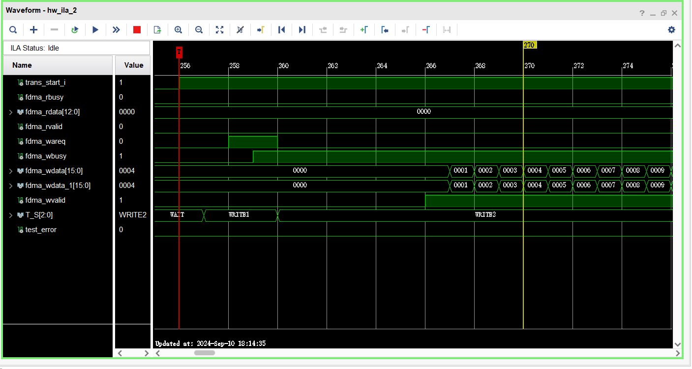

# DMA2LWIP_Demo
通过ZYNQ搭建了数据写DDR和网口上传的demo，目前实现了串口控制，支持串口、网口上传，项目中实现上位机手动触发写DDR和上传，实现简单便于二次开发。

# 开发环境
Vivado/Vitis 2021.2

# 工程列表
SingleSerialPort：Uart控制上位机、VideoDMA_Project：ZYNQ系统（另需添加FDMA ip）

# 实现功能
上位机串口触发，FDMA发送递增数写入DDR3；上位机触发串口/网口上传，PS端通过Uart/LWIP实现上传。

系统RTL如下：

# 功能测试
测试中FDMA的输入和输出结果如下：

通过网口助手简单做下接收测试，网口接收端接收单次触发的数据如下：

结果看到，接收存在少量错误，后续可添加数据缓存操作减少时序错误导致的DDR写入错误。
